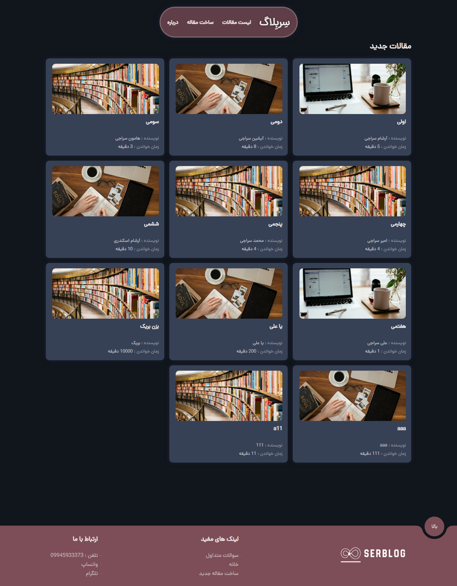
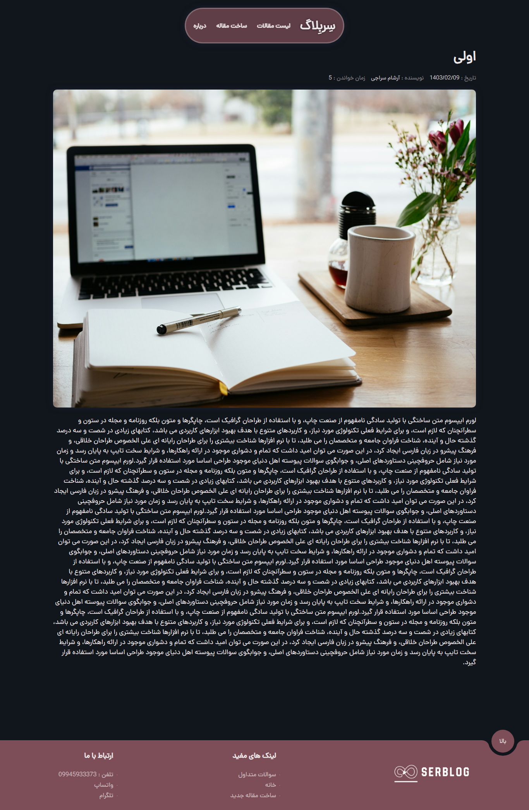

<div align='center'>

<h1>Blog with React</h1>
<h4> <span> · </span> <a href="https://github.com/Arsham13/blog-react/blob/master/README.md"> Documentation </a> <span> · </span> <a href="https://github.com/Arsham13/blog-react/issues"> Report Bug </a> <span> · </span> <a href="https://github.com/Arsham13/blog-react/issues"> Request Feature </a> </h4>


</div>

# :notebook_with_decorative_cover: Table of Contents

- [About the Project](#star2-about-the-project)
- [Contact](#handshake-contact)


## :star2: About the Project

### :camera: Screenshots
<div align="center"> <a href=""></a> </div>
<div align="center"> <a href=""></a> </div>


### :space_invader: Tech Stack
<details> <summary>Client</summary> <ul>
<li><a href="">Arsham Seraji</a></li>
</ul> </details>

### :dart: Features
- react
- react-router-dom
- axios


### :art: Color Reference
| Color | Hex |
| --------------- | ---------------------------------------------------------------- |
| Primary Color |  #7d4e57 |
| Secondary Color |  #11151c |
| Accent Color |  #364156 |
| Text Color |  #f0e9eb |

## :toolbox: Getting Started

### :gear: Installation

This project uses axios
```bash
npm install axios
```
This project uses react-router-dom
```bash
npm install react-router-dom
```


### :running: Run Locally

Clone the project

```bash
https://github.com/Arsham13/blog-react
```
Blog


## :handshake: Contact

Arsham Seraji - - arshamseraji@gmail.com

Project Link: [https://github.com/Arsham13/blog-react](https://github.com/Arsham13/blog-react)
